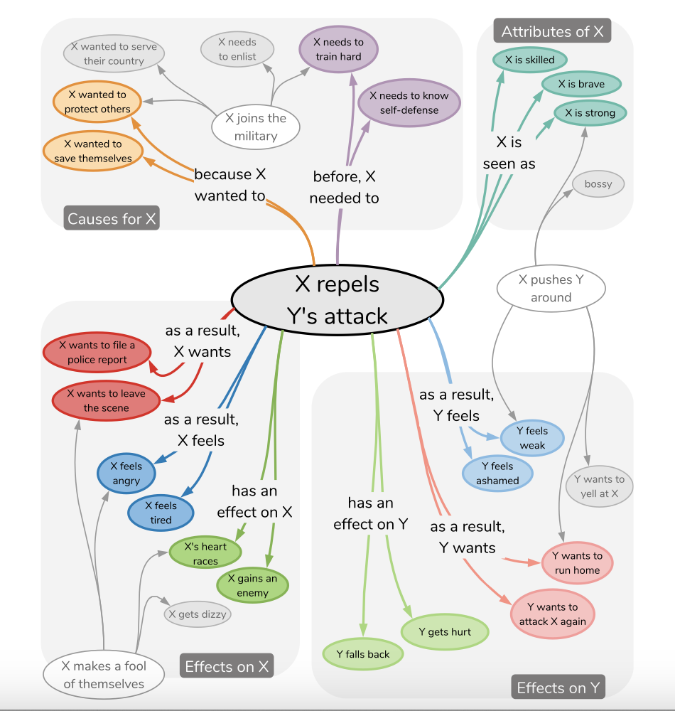

<!-- PROJECT LOGO -->
<br />
<p align="center">
  <h3 align="center">COMET-ATOMIC-En-Zh</h3>

  <p align="center">
   		COMET-ATOMIC ja's translate demonstration in English and Chinese,
      A commonsense knowledge graph on events translate from Waseda University.
    <br />
  </p>
</p>

### Brief introduction
Day-to-Day commonsense reasoning can be operationalized through a densely connected collection of inferential knowledge. Look up below picture:



#### Below is the discussion in [ATOMIC paper](https://arxiv.org/pdf/1811.00146.pdf)<br/>
<b>
“X repels Y’s attack”, we can immediately infer various plausible facts surrounding that event. In terms of the plausible motivations behind the event, X probably wants to protect herself. As for Xr
the plausible pre-conditions prior to the event, X may have a
been trained in self-defense to successfully fend off Y’s attack. We can also infer the plausible characteristics of X; she might be strong, skilled, and brave. As a result of the
event, X probably feels angry and might want to file a police report. Y, on the other hand, might feel scared of getting caught and want to run away.
</b>

<br>
<br>
If you want to see an example in truly data construction, you can look below translate data sample demonstration。

<br/>
<br/>

Waseda University labeled a dataset on [nlp-waseda/comet-atomic-ja](https://github.com/nlp-waseda/comet-atomic-ja) in Japanese and investigate whether models can learn to perform If-Then commonsense inference given a previously unseen event. they explore GPT2 and T5 model respectively. (given an event phrase e and an inference dimension c, the models generates the target t = fθ (e, c).)<br/>
With the help of nowadays Prompt learning problem modeling approach. This can be done easily.

This project focus on translate their corpus into English and Chinese, train T5 style models to check the ability of Prompt learning's adaptability to deal with this kind of problem in English and Chinese.

### Translate data sample demonstration
#### In Japanese (Original)
An example of the JSON objects is as follows:
```json
{'event': {'event': 'Xがパチンコ屋へ行く', 'mental_state': 'Xがパチンコ屋へ行く'},
 'inference': {'event': {'before': ['Xが小遣いをもらう',
    'Xがパチンコで勝つ',
    'Xが金を用意する',
    'Xがギャンブル依存症だと自覚する',
    'Xが車を運転する',
    'Xが金を稼ぐ',
    'Xが金を持っている',
    'Xが時間的余裕を持つ'],
   'after': ['Xが負ける']},
  'mental_state': {'before': ['時間をつぶしたい',
    'ギャンブルがしたい',
    '何か面白いことないかな',
    '時間つぶしだ',
    '暇だ',
    'お金が欲しい',
    'お金を儲ける',
    'ストレス発散したい'],
   'after': ['お金を失う',
    'お金がなくなった',
    'お金をたくさん使う',
    'もう少ししたら帰る',
    'お金が減る',
    'また負けた',
    '当たりそうだ',
    '勝ったら嬉しい',
    '負けて帰ってくる',
    'お金がなくなる']}}}
```

#### In English (Translated)
An example of the JSON objects is as follows:
```json
{'en_event': {'event': 'X is going to the pachinko parlor',
  'mental_state': 'X is going to the pachinko parlor'},
 'en_inference': {'event': {'before': ['X gets an allowance',
    'X wins at pachinko.',
    'X gets the money.',
    'Realize X has a gambling problem',
    'X drives a car',
    'X makes money',
    'X has money',
    'X has time to spare'],
   'after': ['X will lose']},
  'mental_state': {'before': ['X wants to kill time',
    'X wants to gamble',
    'I need something fun to do',
    'X is killing time',
    "I'm not busy",
    'I want money',
    'Make some money',
    'I want to relieve stress'],
   'after': ['Lose money',
    'Money is running out',
    'Spend a lot of money',
    "I'll be home in a little while",
    'X will have less money',
    'I lost again.',
    "I think I'm going to win.",
    "I'll be happy if I win",
    'X comes home defeated',
    'X runs out of money']}}}
```

#### In Chinese (Translated)
An example of the JSON objects is as follows:
```json
{'zh_event': {'event': 'X要去柏青哥店。', 'mental_state': 'X要去柏青哥店。'},
 'zh_inference': {'event': {'before': ['X得到一笔津贴',
    'X在弹子机上赢了。',
    'X拿到钱',
    'X意识到自己有赌博问题',
    'X驾驶汽车',
    'X 挣钱',
    'X有钱了',
    'X有时间'],
   'after': ['X输了一场比赛']},
  'mental_state': {'before': ['X想打发时间',
    'X想赌博',
    '我需要一些有趣的事情来做',
    'X在打发时间',
    '我不忙。',
    '我想要钱',
    '赚点钱',
    '我想缓解压力'],
   'after': ['失去了金钱。',
    '我已经没有钱了',
    '我花了很多钱',
    '我一会儿就回家了',
    'X有更少的钱',
    '我又输了。',
    '我想我要赢了。',
    '如果我赢了，我会很高兴。',
    'X败兴而归',
    'X钱用完了']}}}
```

### Models

I finetuned the English and Chinese T5-base and Lora-based (with the help of [peft](https://github.com/huggingface/peft)) T5-large model on the built graph.<br/>
More info and examples about Lora can be seen in [https://github.com/svjack/ControlLoRA-Chinese](https://github.com/svjack/ControlLoRA-Chinese), it is a Lora
application in Stable Diffusion domain to control the output of image with the help
of Lora-based ControlNet.

#### Installtation
```bash
pip install -r requirements.txt
```

The models are available at Huggingface Models:

|Name |HuggingFace Model link| HuggingFace Space link |
|---------|--------|-------|
|English Comet Atomic  🐢| https://huggingface.co/svjack/comet-atomic-en | https://huggingface.co/spaces/svjack/English-Comet-Atomic |
|Chinese Comet Atomic 🚀| https://huggingface.co/svjack/comet-atomic-zh | https://huggingface.co/spaces/svjack/Chinese-Comet-Atomic |
|Chinese Comet Atomic T5 Lora 🚀| https://huggingface.co/svjack/mt0-large-comet-atomic-zh-peft-early-cpu ||

You can try them online. Or check the model card to use them by yourself.

<!-- CONTACT -->
## Contact

<!--
Your Name - [@your_twitter](https://twitter.com/your_username) - email@example.com
-->
svjack - svjackbt@gmail.com - ehangzhou@outlook.com

<!--
Project Link: [https://github.com/your_username/repo_name](https://github.com/your_username/repo_name)
-->
Project Link:[https://github.com/svjack/COMET-ATOMIC-En-Zh](https://github.com/svjack/COMET-ATOMIC-En-Zh)


<!-- ACKNOWLEDGEMENTS -->
## Acknowledgements
<!--
* [GitHub Emoji Cheat Sheet](https://www.webpagefx.com/tools/emoji-cheat-sheet)
* [Img Shields](https://shields.io)
* [Choose an Open Source License](https://choosealicense.com)
* [GitHub Pages](https://pages.github.com)
* [Animate.css](https://daneden.github.io/animate.css)
* [Loaders.css](https://connoratherton.com/loaders)
* [Slick Carousel](https://kenwheeler.github.io/slick)
* [Smooth Scroll](https://github.com/cferdinandi/smooth-scroll)
* [Sticky Kit](http://leafo.net/sticky-kit)
* [JVectorMap](http://jvectormap.com)
* [Font Awesome](https://fontawesome.com)
* [Stable Diffusion](https://stability.ai/blog/stable-diffusion-public-release)
* [ControlLoRA](https://github.com/HighCWu/ControlLoRA)
* [IDEA-CCNL/Taiyi-Stable-Diffusion-1B-Chinese-v0.1](https://huggingface.co/IDEA-CCNL/Taiyi-Stable-Diffusion-1B-Chinese-v0.1)
* [diffusers](https://github.com/huggingface/diffusers)
* [DeepL](https://www.deepl.com/translator)
* [svjack/Stable-Diffusion-Chinese-Extend](https://github.com/svjack/Stable-Diffusion-Chinese-Extend)
* [svjack/Stable-Diffusion-Pokemon](https://github.com/svjack/Stable-Diffusion-Pokemon)
* [svjack](https://huggingface.co/svjack)
-->
* [nlp-waseda/comet-atomic-ja](https://github.com/nlp-waseda/comet-atomic-ja)
* [ATOMIC paper](https://arxiv.org/pdf/1811.00146.pdf)
* [peft](https://github.com/huggingface/peft)
* [svjack](https://huggingface.co/svjack)
